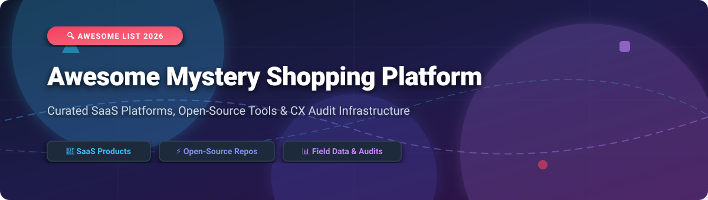

  

      

# 🛒 Awesome Mystery Shopping Platform 🕵️‍♂️

> **A curated directory of top SaaS platforms and open-source software for Mystery Shopping, Customer Experience (CX) Audits, Retail Compliance, Field Data Collection, and Shopper Network Management.**

---

## 📖 Overview & SEO Keywords

Welcome to the **Awesome Mystery Shopping Platform** ecosystem list! Whether you are a retail enterprise, market research agency, CX consultant, or software developer building custom audit tools, this curated index provides a comprehensive breakdown of commercial SaaS providers and community-driven open-source building blocks.

**Keywords**: Mystery Shopping Software, Secret Shopper Apps, Customer Experience Audits, Retail Compliance Software, Field Data Collection, ODK Collect, Form Builders, Shopper Network Dispatch, CX Analytics.

---

## 📑 Table of Contents
- [📊 Market Overview & Industry Dynamics](#-market-overview--industry-dynamics)
- [💼 SaaS & Commercial Platforms](#-saas--commercial-platforms)
- [⚡ Open-Source GitHub Projects](#-open-source-github-projects)
- [🤝 How to Contribute](#-how-to-contribute)
- [⚠️ Disclaimer](#️-disclaimer)
- [📈 Star History](#-star-history)
- [💖 Support](#-support)

---

## 📊 Market Overview & Industry Dynamics

📊 **Estimated Sector Market Size**: The global Mystery Shopping & Customer Experience (CX) Audit market is estimated at **~$4.8 Billion** (projected to reach **~$7.5 Billion** by 2030 at a 6.8% CAGR).

🧩 **Market Structure**: The market is **highly fragmented**, comprising regional mystery shopping providers (MSPs), boutique brand compliance agencies, crowdsourced gig economy apps, and specialized software platforms—without a single winner-take-all monopoly.

---

## 💼 SaaS & Commercial Platforms

Below is a curated table of leading commercial SaaS platforms for mystery shopping, retail execution, and field audit workflows, sorted by **Company Size / Valuation** (descending).

| 🏢 SaaS Platform | 💰 Company Size (Revenue / Valuation) | 🏷️ Starting Tier Price | 🎁 Free Tier / Free Trial Limits | 🚀 Key Features & Focus |
| :--- | :--- | :--- | :--- | :--- |
| **[SafetyCulture (iAuditor)](https://safetyculture.com/)** | **~$2.5B Valuation** (~$100M ARR) | $24 / user / month | **30-day Free Trial** (Free plan available for up to 3 users & 10 form templates) | Enterprise retail inspection, mobile site audit, real-time safety & quality compliance |
| **[Market Force Information](https://www.marketforce.com/)** | **~$65M Revenue** (Acquired by MCI) | $500 / month | **14-day Free Access** to KnowledgeForce analytics demo dashboard | Enterprise customer experience management, secret shopper programs, brand standards audit |
| **[Roamler](https://www.roamler.com/)** | **~$45M Revenue** | $250 / project | **14-day Demo Environment** upon enterprise consultation | Crowdsourced on-demand field data collection, retail audits, and mystery shopping network |
| **[Form.com (GoCanvas)](https://form.com/)** | **~$40M Revenue** (~$120M Valuation) | $45 / user / month | **14-day Free Trial** (Includes 5 completed audit form submissions) | Enterprise mobile field forms, offline compliance audits, and custom workflow routing |
| **[CheckMarket (Netigate)](https://www.checkmarket.com/)** | **~$30M Revenue** | $49 / month | **14-day Free Trial** (Full feature access up to 100 responses max) | Enterprise survey collection, shopper evaluation forms, and CX feedback reporting |
| **[Field Agent](https://www.fieldagent.net/)** | **~$25M Revenue** ($15M Raised) | $10 / audit location | **7-day Demo Trial** with 1 free sample audit run upon strategy session | On-demand mobile retail audits, photo/video evidence capture, and crowdsourced shopper network |
| **[Shopmetrics](https://www.shopmetrics.com/)** | **~$15M Revenue** | $199 / month + $0.50 / shop | **14-day Sandbox Access** for certified market research agencies | Enterprise mystery shopping dispatch, shopper assignment workflow, and client reporting portal |
| **[iSecretShop](https://isecretshop.com/)** | **~$8M Revenue** | $99 / month | **30-day Trial Account** for verified Mystery Shopping Providers (MSPs) | Mystery shopping dispatch engine, shopper mobile application, and evaluation quality control |

---

## ⚡ Open-Source GitHub Projects

Purpose-built mystery shopping software with integrated gig-shopper networks is predominantly commercial. However, powerful open-source building blocks exist—ranging from experience management tools and offline mobile data collectors to survey engines and experimental AI mystery shopper agents.

Below is the list of open-source projects, sorted by **GitHub Stars_Count** (descending).

1. **[Formbricks](https://github.com/formbricks/formbricks)**   
   *Next.js open-source experience management & survey platform for structured customer & mystery evaluation flows.*

2. **[SurveyJS Library](https://github.com/surveyjs/survey-library)**   
   *JSON-driven JavaScript form library for React, Vue, Angular, and JS to construct complex mystery shop questionnaires and audit scoring sheets.*

3. **[LimeSurvey](https://github.com/LimeSurvey/LimeSurvey)**   
   *Battle-tested open-source survey web application designed for complex assessments, multi-tier question logic, and structured evaluative scoring.*

4. **[OhMyForm](https://github.com/ohmyform/ohmyform)**   
   *Free open-source web application for creating embeddable web forms and field feedback collection surveys.*

5. **[Formio](https://github.com/formio/formio)**   
   *Form builder and data management API platform for progressive web and mobile field-reporting applications.*

6. **[ODK Collect (Android)](https://github.com/getodk/collect)**   
   *Mobile Android field-data collection engine designed for offline evaluation, geo-tagged photo/video evidence capture, and structured audit submission.*

7. **[ODK Central](https://github.com/getodk/central)**   
   *Central backend server for managing offline field enumerators, mobile mystery shoppers, form definitions, and incoming audit reports.*

8. **[KoboToolbox KPI](https://github.com/kobotoolbox/kpi)**   
   *Field data collection backend for question library management, shopper form design, and audit submission analytics.*

9. **[KoboToolbox Installer](https://github.com/kobotoolbox/kobo-install)**   
   *Deployment suite for provisioning self-hosted digital inspection and field data collection servers.*

10. **[Churninator (AI Mystery Shopper)](https://github.com/MR-GREEN1337/churninator)**   
    *Autonomous AI agent designed to act as a mystery shopper for SaaS and digital onboarding flows, generating friction analysis reports.*

11. **[Inglobe Mystery Shopper Platform](https://github.com/Inglobe/mystery)**   
    *Open-source web portal template for organizing shopper registration, shop assignment dispatch, and client evaluation reporting.*

---

## 🤝 How to Contribute

Contributions are warmly welcomed! Please follow these simple steps to add or update projects:

1. 🍴 **Fork** this repository.
2. 📝 **Add / Edit** entries in `README.md` (maintaining table/list formatting and accurate details).
3. 🔍 **Provide** name, URL, exact pricing / star details, and concise summary.
4. 📬 **Submit** a Pull Request describing your changes.

Check out [Awesome Awesome Awesome](https://github.com/ishandutta2007/Awesome-Awesome-Awesome) for more curated lists!

---

## ⚠️ Disclaimer

- This is a **community-curated** educational directory—not an endorsement or exhaustive listing.
- Mystery shopping software and operations must strictly comply with local labor, consumer privacy, and data-protection laws.
- Product information, pricing, and financial estimates are derived from publicly available sources and subject to change.

---

## 📈 Star History

---

## 💖 Support

Thank you for visiting **Awesome Mystery Shopping Platform**! 🌟

If you find this repository valuable, please consider supporting the maintainers:
- ⭐ **Star** this repository to help others discover it.
- 🍴 **Fork** it and contribute new platforms or open-source projects.
- 📢 **Share** it with fellow CX researchers, retail managers, and developers.

